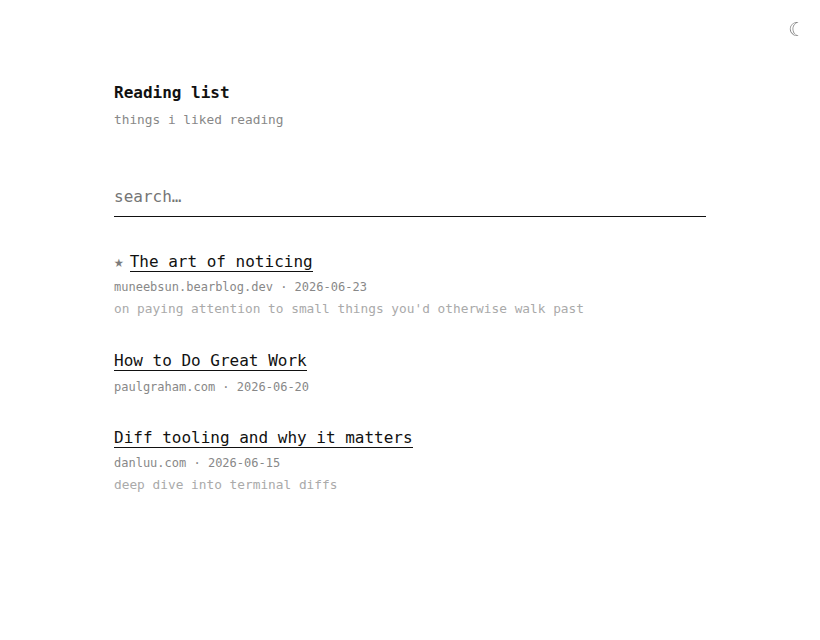
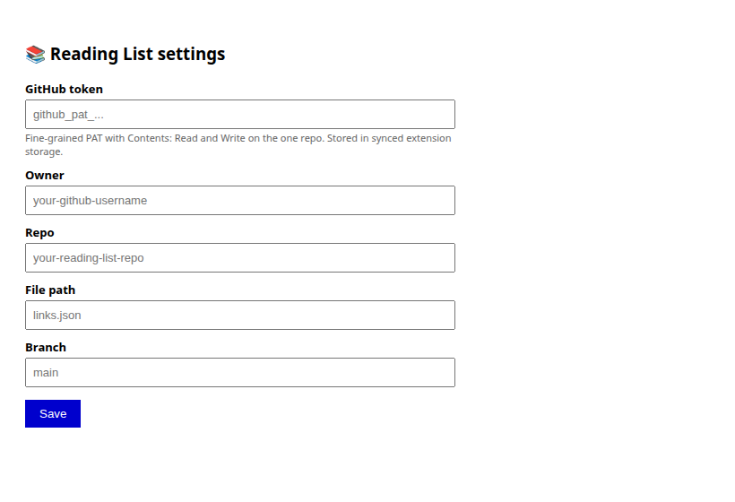

# Reading List

A personal reading list you fully own. It's a simple webpage that shows links
you've saved, like articles, blogs, anything worth keeping. There's no app to
sign up for and no server to pay for. The page lives free on GitHub, and only
you can change what's on it.

## How it works

- **The page** (`index.html`) is a static HTML file hosted on GitHub Pages. It
  fetches `links.json` and renders it: pinned links first, plus search and
  pagination. Visitors only read it.
- **The data** (`links.json`) is a flat JSON array of
  `{url, title, note, date, pinned}`. The single source of truth.
- **The extension** (`extension/`) is your admin tool. The popup grabs the
  current tab and the manage view deletes or pins entries. Every action is a
  commit to `links.json` via the GitHub Contents API, using a personal access
  token you store in the extension. `sha`-based PUTs give optimistic locking.

The token is the auth. Reading the list is public, writing it needs a commit,
and a commit needs your token.

## Setup

1. **Copy it.** [Use this template](https://github.com/hassannawaz1210/reading-list/generate) to make your own repo.
2. **Publish it.** `Settings > Pages`, [deploy from `main`](https://docs.github.com/en/pages/getting-started-with-github-pages/configuring-a-publishing-source-for-your-github-pages-site). Live at `https://<you>.github.io/<repo>/`.
3. **Install the extension.** Download this repo. On your extensions page, turn on Developer mode, choose **Load unpacked**, and pick the `extension` folder.
4. **Get a token.** Create a [fine-grained token](https://github.com/settings/tokens?type=beta) scoped to your repo only, **Contents: Read and write**.
5. **Connect it.** Extension options: paste token, owner, repo, path `links.json`, branch `main`. Save.
6. **Use it.** On any page, click the extension and **Save**.

## Security note

The token lives in the extension's synced storage. Keep it fine-grained
and single-repo so a leak can't reach anything else. Revoke and reissue if
exposed.
